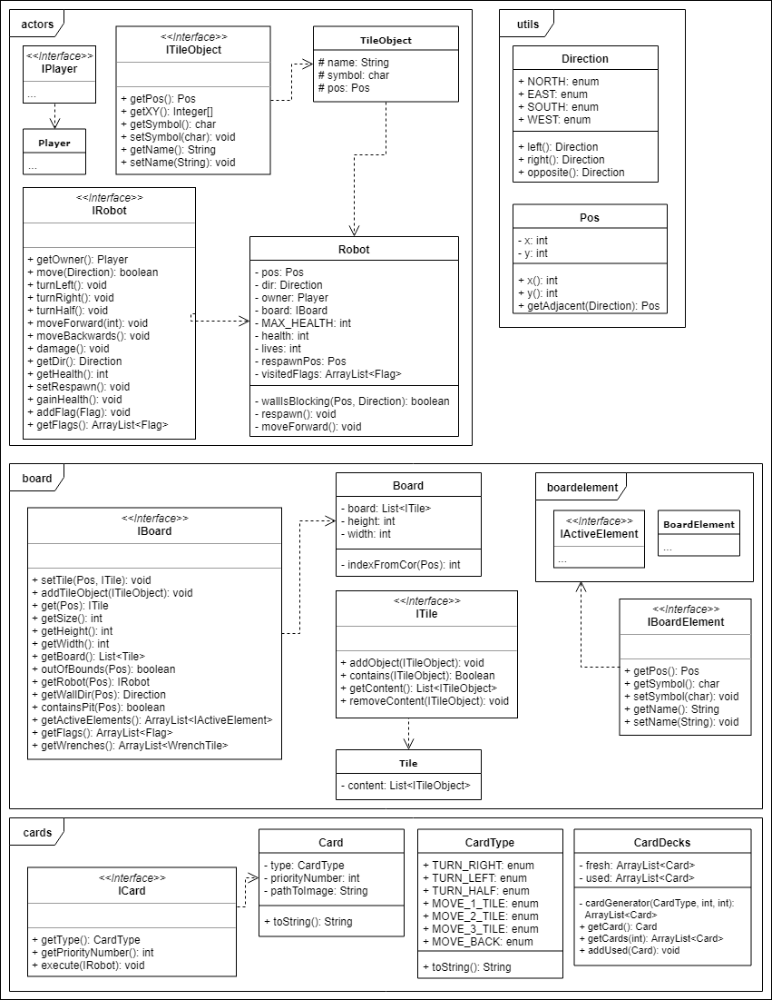
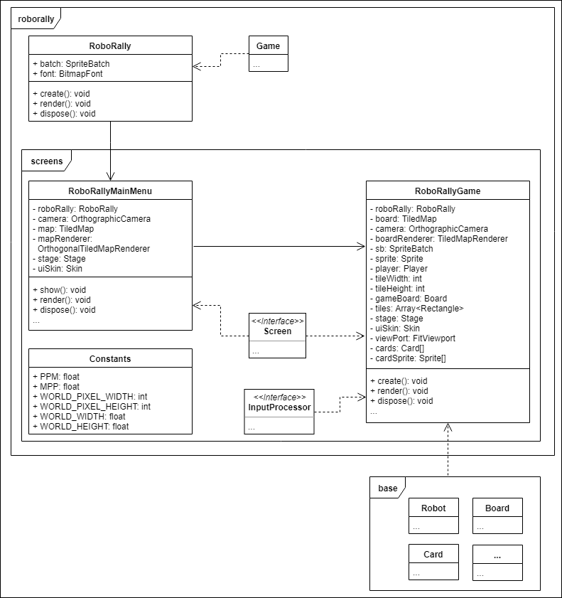

## Mandatory Assignment 3 (g4.team1)

### Part 1

##### How do the roles of the team work? Do you need to update who is team lead or customer contact? Do you need other roles? Write down some points about what the different roles actually mean to you
The roles in the team work nice, even though we haven’t started 
implementing the more advanced rules in the game so the customer contact 
role has not been very relevant.
Our customer contact is learning the game rules and other details until 
we have a working prototype to show it to our customer.
We discussed about having more roles, but with a small team it seems 
unnecessary.

Main roles we have at the moment:
- Teamlead: arrange the meetings and reserves meeting rooms. Manages Git 
and help other in the group understand the task, correct mistakes and 
other things.
- Customer contact: understanding the requirements from the customer and 
the rules of the game, and supporting the rest of the team.
- Coder: completes tasks that are posted on the Kanban board, reports 
bugs, discusses design choices.

##### Are there any experiences either team-wise or regarding project methodology that is worth mentioning? Does the team think the choices you've made are good? If not, what can you do differently to improve the way the team works? 
We are using pair programming, scrum sprints and kanban. It works for 
the most part, but sometimes the progress during the sprint can be not 
very significant.
We need to improve on both splitting up tasks to smaller sub-tasks, and 
being more clear on who is working on what so it is easier for team 
members to start working on a task.
We also need to be more consistent on adding TODO’s in the code, and 
update the TODO kanban board.

##### How are the group dynamics?
The group works pretty well for the most part. Everyone tries to do 
their best, depending on their current skills. It’s also worth 
mentioning that we haven’t missed any planned meeting.

##### Specify the knowledge shared within the team, and how the transfer of said knowledge is done between team members
The knowledge is mainly shared during labs and during sprints via 
face-to-face communication, and also via messages on slack and facebook. 
Everyone tries to help if someone encounters a problem with specific task.

##### How does communication work for you?
Our group is good at communicating face to face in the meetings we have 
through the week. We have a lot of discussions of how we are thinking 
on how we should solve the tasks and problems. 
We could however improve the situation when it comes to using slack and 
try to not think of it as a very formal place of communication. We 
should also use it more frequently both when one has problems with the 
code and not just for listing completed tasks and which tasks are in 
progress.

##### Make a brief retrospective in which you consider what you have done so far and what can be improved
Since the last mandatory we’ve added several game elements such as 
cards, board with tiles, and others, and we are planning to add game 
round mechanics and actual cards into the game.
We were discussing and changing the structure of the project every time 
we met because the structure has to be adapted to the new requirements 
and changes to the game logic. For example, the system of coordinates 
was changed several times and it will probably be changed again in 
future. Because of that the rendering method had to be changed a little 
bit, and all other classes which use the coordinates had to be updated 
as well.
In general we can say that the progress is pretty stable.

##### From the retrospective agree and write down three things (max), that the team will follow up during the next sprint

- Be more detailed and provide instructions in the cards that we make on 
our Kanban board in order to make it easy for other group members to 
understand what the creator thought when making the cards.
- Take ten minutes in the start of meeting to talk about what we did 
since last time and ten minutes at the end discussing what we want to 
achieve till next meeting.
- Use slack more for discussion code and problems.

### Part 2

##### Clarification of the customer's requirements. What are the actual tasks?
Here’s the list of current requirements and priorities:

* Can get all the types of cards that move the robot 
(CardDecks class that generates cards)
* Deal nine cards to choose from 
(CardDecks takes a top card from a list, 9 times)
* Choose 5 cards from the 9 cards (confirm the selection by “ready to continue) 
(game should have several interactive areas with listeners to register players choices)
* Execute the program based on the chosen cards 
(game needs to ‘sort’ cards by priority number and call execute())
* Visit flag 
(game needs to check if robots are on top of flags at end of turn)
* If robot gets out of bounds of the board it gets destroyed and respawns on the last respawn point
(game needs to check the positions of the robots after each turn)
* Update the respawn location if robot is on the wrench tile at the end of the phase.
(game needs to check if robots are on top of wrench tile at end of turn, game calls updateRespawn() or something on robot)
* Move the respawn point to the coordinates of the visited flag
(game calls updateRespawn() or something on robot)
* Implement the game round and round phase (turn)
(game keeps track of the current phase and activates the proper gameobjects and cards at the right time)
* Get new cards to choose from each round
(CardDecks class generates cards)

##### How do the team prioritize these tasks? 
We focused on finishing the board and its elements (like robot and wrench), and then focus on the game cards as well. We also prioritize the implementation of the game round and phase mechanics, so that we can emulate the basic flow of the game.

##### If changes are made in order from what is given by the customer, why is this done? 
We didn’t change the priority of the tasks since we haven’t contacted the customer yet. We have only adjusted the priority of some tasks based on the list of requirements that was posted at mitt uib. Right now we are making sure that all the functions we are implementing are working correctly.

##### How will you verify that the requirements are met? (What are the acceptance criteria?) 
First of all, all the tests should pass. Then we manually check if the feature works correctly in different situations and that there are no conflicts with other features. The feedback from the customer can also be used to verify if the requirement is met, but we haven’t contacted the customer yet.

##### Update what your priorities are, how far you have come and what you have done since last time
Our main priorities now are to implement the game round and game phase functionality, render the cards on the screen at the correct coordinates, and implement fully working game round.
Since the last report we have migrated from Gradle to Maven, implemented the rendering of the board and the robot on the screen, started on game round and phase functionality, started on rendering the cards on the screen. We also changed the positioning system from (x, y) coordinates to using the “pos” object. We have also added several tests for cards, wrench and pusher objects, and some others. We added the maven test automation to the project too, and the test coverage is 91% of base game logic classes.

## UML Class Diagrams

