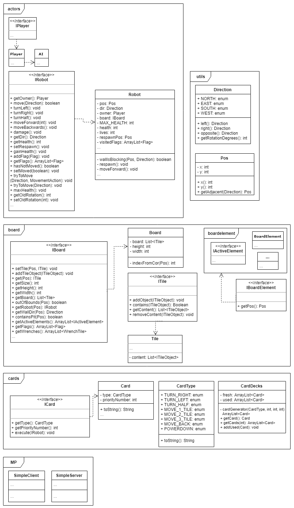

# Mandatory Assignment 5 (g4.team1)

## 1. Project and project structure
#### Are there any experiences either team-wise or regarding the project methodology worth mentioning? Does the team think the choices you've made are good? If not, what can you do differently to improve the way the team works? 
When we started the project none of us knew of libGDX, we found it a bit challenging to finish the assignments as well as focusing on learning what we needed to know about libGDX to get a best possible result. 
Had we started on the project with the knowledge we now have about libGDX it would have been easier to focus more on the structure and creating a code fitting for the task. 
Our team thinks that we struggled more than we should have, without a proper introduction to the tools that we were supposed to use to create the project.

#### How is the group dynamics?
Everyone in the group participated in the development process, we helped each other with common problems. By being open with each other about the problems we had we worked more efficiently as well as improved the dynamic of the group over the time. 
People became aware of the different preferences on tasks and knowledge people had and we could separate our tasks better based on this as well and know who to ask when hitting a problem. 
We also worked together on problems so that everyone understood the different parts of the code and how the game worked. 

We worked most efficiently during the meetings and thus we focused on having meetings regularly as well as working separately when needed. By having meetings at least two times a week the progress was mostly consistent. 
We used pair-programming as this made us work more efficient and also helped us teach and learn from each other. Thus, we conclude that our group has a good dynamic and works well. 

#### How does communication work for you?
We discussed all of the design choices, and made suggestions about how to deal with problems. The communication during the meetings have always worked well and we explained and discussed code implemented at home if needed. 
At the start of the project people were naturally more reserved, especially on slack and messenger. However after a few weeks we communicated more often using these channels as well. We work well together as a team and always answer each others questions. 

#### Perform a retrospective before delivery with a focus on the entire project
##### What did you adjust along the way, and why? Was it better? 
We adjusted our use of the project board along the way. In the beginning we did not write out the tasks in detail, after adding details the workload became more manageable and understandable. 
By adding the tasks and being able to put them in the “done” section it made the project more motivating because we could see our own progress.

We also started to use fewer branches because we found out that we don’t need that many. It’s not a good practice, but in our case it worked well. 
We found out that making less branches and working in our main branch to improve code and so on was better than making small changes in a different branch and then merging and thus we got fewer merging conflicts and etc. 

Finally, we had a lot of problems setting up the project itself. It was hard to start without any introduction to the tools like Gradle or Libgdx. 
We started the project with Gradle template, but then after some time we moved to Maven since it was the suggested to us later, and it caused a lot of problems. 
We think that if we were provided a starting point in the form of the project that contained all the tools like Libgdx and Maven installed, then we would have had a much better and easier experience with the early development stages. 
Instead we spent a lot of time just to start to work with the project.

##### What worked the best and why? (What are you most satisfied with?) 
The way the group has communicated when working in the lab groups and on meetings has always been very good. People respected each other and the differences in the level of knowledge. 
This made it easy to work together and made the group dynamic function well.

Throughout the project we had meetings regularly either on mondays or wednesday as well as the lab on thursdays. In addition to this we had a few meetings when it was necessary. 
By meeting regularly it was easy to communicate and get help if someone was stuck on a problem.  

We are also mostly happy with the way we used branches and git in general. This made it easy for everyone to participate in the project without messing up someone else's work on the project. 
Git made it possible to separate different task and work cohesively to achieve different goals and merge each other’s progress together into one place. 

The way we structured the project has also been good. We have a google doc folder where we add all the assignment files as well as the meeting logs. 
This made it easy for everyone to contribute to the writing as well as find the project files and so on. 

##### If you were to continue with the project, what would you adjust?
During our project we mostly used Kanban board for keeping our tasks in one place, even though this has worked fine we think that if we were to continue the project we should use sprints more actively as well. 
They are a great way of getting things done fast and we could have improved the way we worked by using them more. 

We also would have focused on adding more tests and testing on a larger scale. We think that testing small parts of the code is easy while larger parts were mostly tested manually. 
Since we usually test manually it has not been a problem. However it is not an ideal solution for some parts of the code. 

##### What is the most important thing you have learned?
The most important thing we learned is that such projects require a lot of time and dedication, and good time management is critical. Sometimes you have to use “spaghetti code” to solve simple problems and focus on bigger goals. 
It is important to be patient with each other and motivate each other to continue when someone “hits a wall”.

Everyone has also learned more about git and its uses and version control in general, and of its importance. 

We also learned that it’s important to get inspiration from other team’s projects and to share the knowledge with other teams. We think that this way the teams will get more experience and understanding of the project itself.

## 2. Requirements
#### Minimum Product Requirements (MVP) 
Here is the list of requirements that were implemented. Some of them (AI and Game Over for example) were easy to implement, and some (lasers and power down) were a little bit harder. 
We also started implementing the multiplayer functionality, but had to stop at some point because we were not satisfied enough with the way it works and we didn't have time to finish this part. 
The player can choose to create a server, and the client can connect to the server, but the game itself does not work via the LAN in this snapshot.

##### \+ One must be able to play a complete round

##### \+ One must be able to win the game game by visiting the last flag (completing a game)

##### \+ There must be lasers on the board

##### \+ There must be holes on the board

##### \+ Injury mechanisms (player gets fewer cards in case of injury)

##### \+ Game mechanisms to shoot other players within reach, with a laser pointing straight ahead

##### \+ Functioning assembly line on the board that moves the robots

##### \+ Functioning gyros on the board that move the robots

##### \+ Game over after 3 lost lives

##### \+ Power down

##### \+ Assembly line that runs at double speed

##### \+ Play against AI (single-player mode), possibly play against random robots

##### \- Multiplayer over LAN or Internet

##### \- Error handling by disconnect

## 3. Code

#### Submit a list (and brief description) of known faults and weaknesses in the product
- Screen resolution scaling
    - fits 1920x1080 screens, playable on higher resolutions.
    - however it does not work on a lower resolution.
- not tested on linux (no computers in group).
- libgdx timer stops when window is out of focus, game still works after a small delay.

#### Document how the project builds, tests, and runs and how the tests should be run
Use `mvn package` or `mvn clean dependency:copy-dependencies compile assembly:single package` to generate the jars. Use `mvn test` to run the tests.

We have made automated tests for some parts of the code. Some functionality was tested manually, such as graphical elements and so on. 
To run all the automated tests manually you need to navigate to the test folder and execute the tests. 

#### Changes to the given rules
We decided to change the rule about how respawn works so that robot respawns instantly after death. Our reasoning for this is that it made the game more fluid and easier to understand. 

Furthermore, we decided to have the robots shoot at the end of each round and not each phase as it became quite messy having them shoot all the time and we felt the game looked and played better with fewer shootings. 

## Class diagrams

